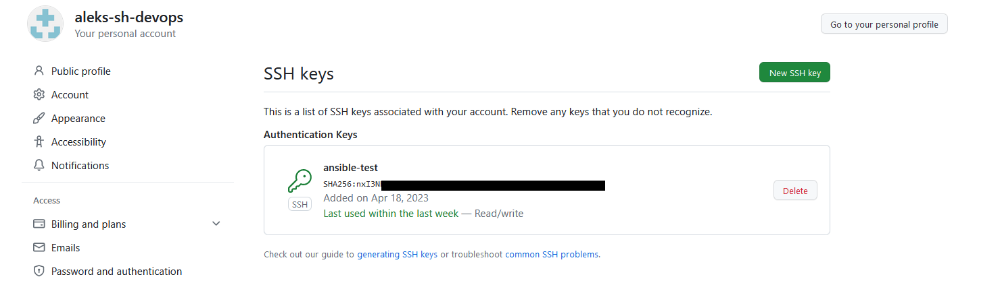

# Домашнее задание к занятию "8.4 Работа с Roles"


1. Создайте два пустых публичных репозитория в любом своём проекте: vector-role и lighthouse-role.  

https://github.com/aleks-sh-devops/vector-role  
https://github.com/aleks-sh-devops/lighthouse-role  

2. Добавьте публичную часть своего ключа к своему профилю в github.
  

## Основная часть

Наша основная цель - разбить наш playbook на отдельные roles. Задача: сделать roles для clickhouse, vector и lighthouse и написать playbook для использования этих ролей. Ожидаемый результат: существуют три ваших репозитория: два с roles и один с playbook.

## Данный плейбук подтягивает роли с помощью requirements clickhouse, vector, lighthouse и производит их установку

# Команда для запуска:  
```
ansible-galaxy install -r requirements.yml -p roles

ansible-playbook -i inventory/prod.yml site.yml
```

## Примечание: playbook работает только с пакетным менеджером yum  

License
-------

MIT

Author Information
------------------

aleks sh
